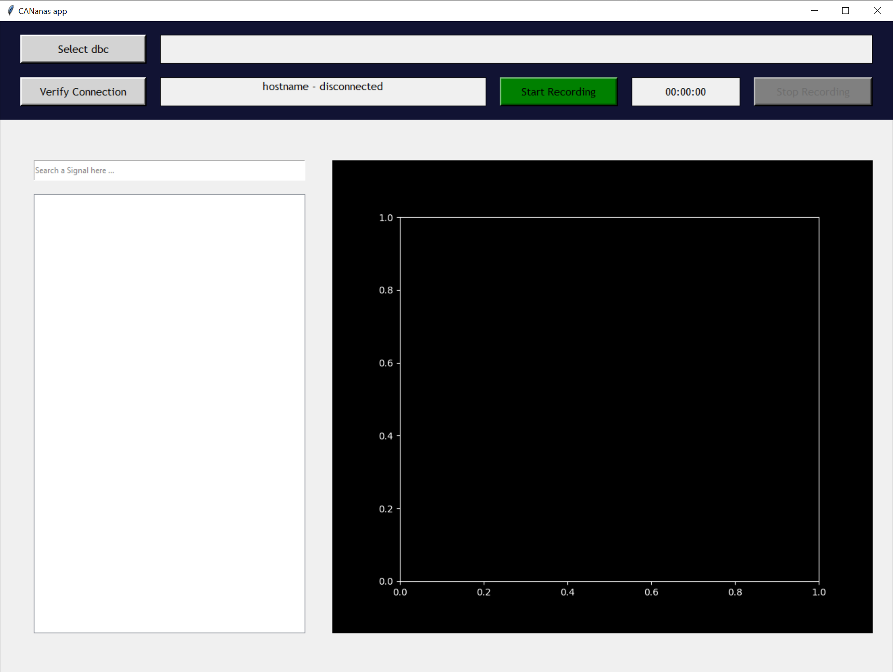

# CAN-CANanas_app
Desktop app to connect to PeCAN device from a laptop, send TCP request and receive CAN trace to plot it.

## Pre-required:
The user need to set up a hotspot from is laptop with the proper ssid, password and bandwidth to allow the PeCAN device to connect.
Please check as well [Pecan repository](https://github.com/Pierre-Cng/CAN-PeCAN_device).

## Functionnement:
The app has a GUI that allows the user to **select a dbc file** that will be transfered to the device to do the CAN decoding. The user can then **verify the connection** with the device. Once those steps are done the Start button can be used to **receive and plot** the CAN messages (Please note that the device scan take up to 30 seconds to start recording). The GUI has a tree checklist containing the messages and signals available in the dbc, the user can **select signals to plot them on the graph**. A search bar above the tree allows the user to **look for a specific message/signal**. Once the user is done with recording, the Stop button can be clicked, it will send a request to the PeCAN to **stop the recording**, **copy the log files** in the current directory thanks to a sftp request and then send a clean request to the device to **remove the local log files**. 

